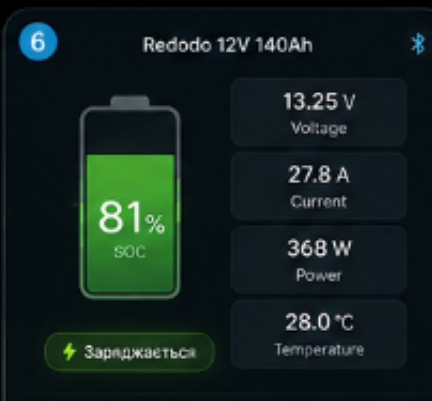
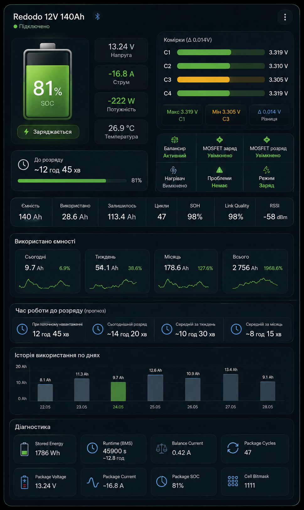
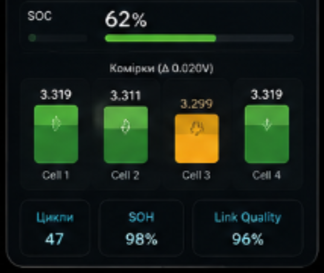
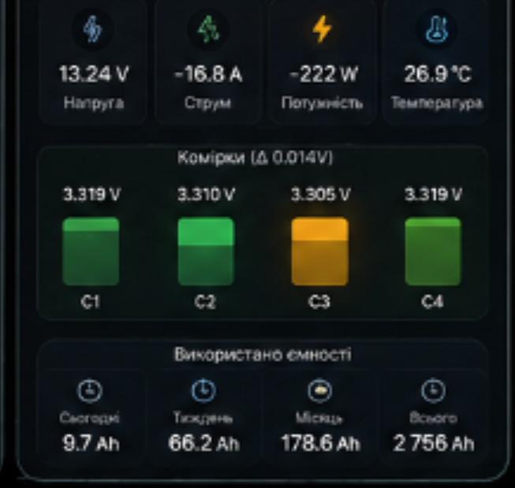

# ha-bms-ble-card

Lovelace-картка для Home Assistant, яка візуалізує максимум параметрів з BLE
BMS-акумуляторів (LiFePO4), інтегрованих через
[BMS_BLE-HA](https://github.com/patman15/BMS_BLE-HA).

Не прив'язана до конкретного бренду — працює з будь-якою батареєю, яку
підтримує ця інтеграція: Redodo, LiTime, PowerQueen, JBD/Jiabaida, Daly, JK,
ANT, Seplos, Renogy та інші.

## Скріншоти

Дизайн-референси, за якими побудована картка (реальні скріни з живого
дашборда додам після ширшого тестування — компактний layout з v1.2.0 трохи
щільніший за ці макети, а з v1.3.0 комірки відображаються батарейками
замість смужок, але загальна структура секцій та їхній зміст ті самі):

| Widget-режим | Full-view (широкий) |
|---|---|
|  |  |

| SOC + комірки | Використана ємність |
|---|---|
|  |  |

## Можливості

- Два режими відображення: `widget` (компактний вигляд + fullscreen попап при
  натисканні) і `inline` (одразу повна картка, вбудована в дашборд)
- SOC-індикатор у вигляді справжньої форми батареї (збільшений в v1.3.0,
  щоб рівень заряду було краще видно), напруга/струм/потужність/температура
- Напруга кожної комірки — окремою мініатюрною батарейкою (не смужкою),
  з кольоровим кодуванням дисбалансу (configurable пороги). **Кількість
  комірок картка визначає автоматично** — за довжиною масиву
  `entities.cell_voltages` або, якщо він не заданий, за довжиною атрибута
  `cell_voltages` сенсора `delta_cell_voltage`. Нічого прошивати вручну
  не потрібно
- **Назва батареї підтягується автоматично** з Device Registry (пристрій,
  до якого прив'язана BMS_BLE-HA), з fallback на friendly_name сенсора;
  `name` в конфізі — опційний override, а не обов'язкове поле
- Статус BMS: заряджається/розряджається/проблема, балансир, MOSFET заряду і
  розряду, нагрівач
- Link quality / RSSI Bluetooth-з'єднання
- Прогноз часу роботи (runtime) — миттєвий, "скільки лишилось за поточним
  навантаженням"
- **Setup Wizard прямо в редакторі картки** — кнопка сама створює:
  - хелпери використаної ємності: сьогодні/тиждень/місяць/всього (скільки
    ємності взяли з акумулятора)
  - хелпери часу розряду: сьогодні/тиждень/місяць (скільки батарея
    пропрацювала, віддаючи енергію) — потрібен `entities.charging`
  і сама підставляє отримані entity_id у конфіг картки (див. розділ нижче)
- Компактний layout, що адаптується під фактичну ширину картки на дашборді
  (не під ширину вікна) — 1 колонка на вузьких картках, 2 колонки на
  широких, без зайвого розтягування по вертикалі
- Адаптивний layout під портретну/альбомну орієнтацію (fullscreen попап у
  widget-режимі)

## Встановлення

### HACS (рекомендовано)

1. HACS → три крапки у верхньому правому куті → **Custom repositories**
2. URL: `https://github.com/kdinya/ha-bms-ble-card`, категорія **Lovelace**
3. Знайти **BMS BLE Battery Card** і встановити
4. Перезавантажити браузер (Ctrl+F5)

### Вручну

1. Завантажити `dist/ha-bms-ble-card.js` з останнього
   [релізу](https://github.com/kdinya/ha-bms-ble-card/releases)
2. Покласти у `config/www/ha-bms-ble-card.js`
3. Settings → Dashboards → три крапки → Resources → додати
   `/local/ha-bms-ble-card.js` як JavaScript Module

## Передумова: інтеграція BMS_BLE-HA

Ця картка не читає Bluetooth напряму — вона відображає entities, які створює
[BMS_BLE-HA](https://github.com/patman15/BMS_BLE-HA). Встановіть і
налаштуйте цю інтеграцію першою (доступна в HACS за замовчуванням).

Після додавання батареї увімкніть diagnostic-сенсори (вимкнені за
замовчуванням): `delta cell voltage`, `max/min cell voltage`, `link quality`,
`RSSI`, а також binary_sensors `balancer`, `chrg/dischrg mosfet`, `heater`.

## Конфігурація картки

```yaml
type: custom:ha-bms-ble-card
display_mode: widget   # або: inline
# name: необов'язково — якщо не вказати, картка сама підтягне назву
# з Device Registry (пристрій батареї в BMS_BLE-HA) або з friendly_name сенсора
entities:
  voltage: sensor.redodo_voltage
  current: sensor.redodo_current
  power: sensor.redodo_power
  soc: sensor.redodo_soc
  temperature: sensor.redodo_temperature
  runtime: sensor.redodo_runtime
  stored_energy: sensor.redodo_stored_energy
  charge_cycles: sensor.redodo_charge_cycles
  delta_cell_voltage: sensor.redodo_delta_cell_voltage
  max_cell_voltage: sensor.redodo_max_cell_voltage
  min_cell_voltage: sensor.redodo_min_cell_voltage
  link_quality: sensor.redodo_link_quality
  rssi: sensor.redodo_rssi
  charging: binary_sensor.redodo_battery_charging
  balancer: binary_sensor.redodo_balancer
  chrg_mosfet: binary_sensor.redodo_chrg_mosfet
  dischrg_mosfet: binary_sensor.redodo_dischrg_mosfet
  heater: binary_sensor.redodo_heater
  problem: binary_sensor.redodo_problem
  # опційно, якщо не задано - картка сама візьме масив із cell_voltages
  # attribute сенсора delta_cell_voltage (кількість комірок = довжина масиву,
  # визначається автоматично в обох випадках)
  cell_voltages:
    - sensor.redodo_cell_1
    - sensor.redodo_cell_2
    - sensor.redodo_cell_3
    - sensor.redodo_cell_4
  # опційно - див. розділ "Сенсори споживання і часу розряду" нижче
  capacity_daily: sensor.redodo_capacity_daily
  capacity_weekly: sensor.redodo_capacity_weekly
  capacity_monthly: sensor.redodo_capacity_monthly
  capacity_total: sensor.redodo_capacity_total
  discharge_time_daily: sensor.redodo_discharge_time_daily
  discharge_time_weekly: sensor.redodo_discharge_time_weekly
  discharge_time_monthly: sensor.redodo_discharge_time_monthly
thresholds:
  cell_delta_warning: 0.02
  cell_delta_critical: 0.05
```

Всі ключі в `entities` опційні — якщо якийсь сенсор не вказано, відповідний
блок картки просто не рендериться замість помилки.

## Individual cell voltages без окремих сенсорів

BMS_BLE-HA не створює entity на кожну комірку — вони лежать в атрибуті
`cell_voltages` сенсора `delta cell voltage`. Якщо не хочете створювати
`cell_voltages` вручну в конфізі картки, залиште цей ключ пустим — картка сама
прочитає масив з атрибута, і кількість мініатюрних батарейок-комірок у
картці автоматично відповідатиме довжині цього масиву. Якщо ж хочете окремі
сенсори (наприклад, для графіків історії в HA), додайте template sensors:

```yaml
template:
  - sensor:
      - name: redodo_cell_1
        unique_id: redodo_cell_1
        state: >-
          {{ state_attr('sensor.redodo_delta_cell_voltage', 'cell_voltages')[0] }}
        unit_of_measurement: "V"
        device_class: voltage
        state_class: measurement
      - name: redodo_cell_2
        unique_id: redodo_cell_2
        state: >-
          {{ state_attr('sensor.redodo_delta_cell_voltage', 'cell_voltages')[1] }}
        unit_of_measurement: "V"
        device_class: voltage
        state_class: measurement
      - name: redodo_cell_3
        unique_id: redodo_cell_3
        state: >-
          {{ state_attr('sensor.redodo_delta_cell_voltage', 'cell_voltages')[2] }}
        unit_of_measurement: "V"
        device_class: voltage
        state_class: measurement
      - name: redodo_cell_4
        unique_id: redodo_cell_4
        state: >-
          {{ state_attr('sensor.redodo_delta_cell_voltage', 'cell_voltages')[3] }}
        unit_of_measurement: "V"
        device_class: voltage
        state_class: measurement
```

## Сенсори споживання і часу розряду

### Setup Wizard (автоматично, з редактора картки)

Якщо в `entities` вже вказано `power` (або хоча б `current`), у GUI-редакторі
картки (клацнути на картку → в нижній частині форми) з'явиться кнопка
**"Створити сенсори споживання і часу розряду"**. Вона:

1. Перевіряє, чи такі helper-сенсори для цієї батареї вже створювались
   раніше (за назвою) — щоб не плодити дублікати при повторному відкритті.
2. Створює один helper `integration` (Riemann sum, накопичена ємність за
   весь час — не скидається) на основі `entities.power`, і три helpers
   `utility_meter` (daily/weekly/monthly) поверх нього — **скільки ємності
   взято з акумулятора**.
3. Якщо в конфізі вказано `entities.charging` — додатково створює три
   helpers `history_stats`, які рахують, скільки часу за останню
   добу/тиждень/місяць сенсор заряду перебував у стані "off"
   (тобто АКБ не заряджався, а віддавав/тримав енергію) — **скільки часу
   АКБ пропрацював, віддаючи енергію**. Якщо `entities.charging` не задано,
   ця частина пропускається з поясненням, а хелпери ємності все одно
   створюються.
4. Автоматично підставляє отримані `entity_id` в `entities.capacity_*` і
   `entities.discharge_time_*` конфіга картки.

Потрібні admin-права користувача HA; без них картка покаже повідомлення і
запропонує мануальну інструкцію нижче. Майстер користується тим самим
внутрішнім механізмом, що і Settings → Helpers → + Add helper, тому може
знадобитись підправити вручну, якщо структура полів зміниться в майбутніх
версіях HA — мануальний спосіб нижче завжди залишається робочим fallback.

> **Про точність часу розряду.** BMS_BLE-HA не публікує окрему сутність
> "під навантаженням" — майстер апроксимує це як "не заряджається" (стан
> `off` сенсора `charging`), що включає і час повного простою без
> навантаження. Якщо потрібна точніша метрика — замініть джерело
> `history_stats` на власний template binary_sensor з умовою по struму/
> потужності (наприклад `current < -0.5`).

### Helper-сенсори вручну

BMS_BLE-HA не рахує накопичену ємність і час розряду сам — це стандартні
HA helpers: `integration` (Riemann sum) + `utility_meter` для ємності,
`history_stats` для часу розряду.

**Ємність:**

```yaml
sensor:
  - platform: integration
    name: redodo_capacity_integral
    source: sensor.redodo_power
    unit_prefix: k
    round: 2
    method: left

utility_meter:
  redodo_capacity_daily:
    source: sensor.redodo_capacity_integral
    cycle: daily
  redodo_capacity_weekly:
    source: sensor.redodo_capacity_integral
    cycle: weekly
  redodo_capacity_monthly:
    source: sensor.redodo_capacity_integral
    cycle: monthly
  redodo_capacity_total:
    source: sensor.redodo_capacity_integral
    cycle: yearly
```

**Час розряду** (потребує `binary_sensor.redodo_battery_charging`):

```yaml
sensor:
  - platform: history_stats
    name: redodo_discharge_time_daily
    entity_id: binary_sensor.redodo_battery_charging
    state: "off"
    type: time
    duration:
      days: 1
  - platform: history_stats
    name: redodo_discharge_time_weekly
    entity_id: binary_sensor.redodo_battery_charging
    state: "off"
    type: time
    duration:
      days: 7
  - platform: history_stats
    name: redodo_discharge_time_monthly
    entity_id: binary_sensor.redodo_battery_charging
    state: "off"
    type: time
    duration:
      days: 30
```

Або через UI: **Settings → Devices & Services → Helpers → + Add helper →
Integration - Riemann sum**, потім **Utility Meter** x4, а для часу
розряду — **History Stats** x3 (за стандартним record retention це вимагає,
щоб Recorder зберігав історію на потрібний період, за замовчуванням 10
днів — для тижневого/місячного вікна збільшіть `recorder.purge_keep_days`).
Отримані entity_id вкажіть в `entities.capacity_*` і
`entities.discharge_time_*` конфіга картки.

## Обмеження

- Картка не надає керування зарядом/розрядом БМС (switches) — це свідоме
  рішення автора BMS_BLE-HA з міркувань безпеки акумулятора. Картка — тільки
  моніторинг.
- Одна картка = одна батарея. Для кількох акумуляторів додайте кілька карток.
- Час розряду — апроксимація за станом `charging` (див. примітку вище), а
  не пряме вимірювання струму розряду під навантаженням.

## Розробка і тести

```bash
npm test
```

Тести (`node --test`) перевіряють чисті допоміжні функції картки:
форматування значень, кольори SOC/комірок, заповнення міні-батарейок
комірок за напругою, пороги дисбалансу.

## Ліцензія

MIT
