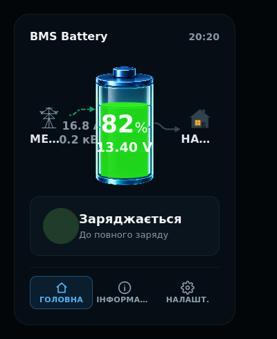

# ha-bms-ble-card

[English version](README.md)

[](https://github.com/hacs/default)
[](https://github.com/kdinya/ha-bms-ble-card/releases)
[](LICENSE)

Сучасна, інформативна та адаптивна картка Lovelace для Home Assistant, призначена для візуалізації та моніторингу акумуляторів з BLE BMS (Redodo, LiTime, JBD, Daly, JK, Seplos тощо), підключених через інтеграцію [BMS_BLE-HA](https://github.com/patman15/BMS_BLE-HA).



---

## Особливості

- **Інтерактивна анімація стану**: динамічне відображення заряду/розряду, візуальний індикатор банки акумулятора та розрахунок орієнтовного часу (ETA).
- **Посекційний моніторинг комірок**: напруги кожної комірки, автоматичне підсвічування максимальної, мінімальної напруги та дельти, індикація активного балансування.
- **Статистика споживання та циклів**: окремий облік витраченої ємності (Ah) та енергії (Wh/kWh), тривалості заряду та розряду за періоди (сьогодні, вчора, тиждень, місяць, рік, довільний період).
- **Повне автовизначення (Auto-Discovery)**: достатньо обрати пристрій батареї у візуальному редакторі — усі сенсори, включаючи приховані за замовчуванням, підтягнуться автоматично.
- **Майстер налаштування (Setup Wizard)**: автоматичне створення допоміжних сенсорів Home Assistant для точної статистики в один клік прямо з картки.
- **Двомовність (UA / EN)**: миттєве перемикання мови інтерфейсу в налаштуваннях картки без перезавантаження сторінки.

---

## Встановлення

### Спосіб 1: HACS (Рекомендовано)

1. Відкрийте **HACS** → **Інтеграції / Інтерфейс** → меню з трьома крапками вгорі праворуч → **Custom repositories** (Користувацькі репозиторії).
2. Вставте URL: `https://github.com/kdinya/ha-bms-ble-card`
3. Оберіть тип: **Lovelace (Dashboard)** та натисніть **Додати**.
4. Знайдіть **BMS BLE Battery Card** у списку та натисніть **Завантажити**.
5. Оновіть сторінку браузера.

### Спосіб 2: Вручну

1. Завантажте файл `ha-bms-ble-card.js` з [останнього релізу](https://github.com/kdinya/ha-bms-ble-card/releases).
2. Скопіюйте його у папку `config/www/` вашого Home Assistant.
3. У розділі **Панелі приладів** → **Ресурси** додайте новий ресурс:
   - URL: `/local/ha-bms-ble-card.js`
   - Тип: `JavaScript Module`

---

## Швидкий старт

1. Переконайтеся, що акумулятор підключено через інтеграцію [BMS_BLE-HA](https://github.com/patman15/BMS_BLE-HA).
2. Додайте картку на дашборд через візуальний редактор або додайте YAML:

```yaml
type: custom:ha-bms-ble-card
device_id: YOUR_BMS_BLE_DEVICE_ID
```

*(Картка автоматично виявить усі доступні сенсори вашого пристрою).*

---

## Статистика та помічники

Для коректного підрахунку статистики розряду/заряду та енергії картка використовує лічильники HA. Ви можете згенерувати їх автоматично:
1. Відкрийте картку в режимі редагування.
2. Натисніть кнопку **Setup Wizard**.
3. Дотримуйтесь підказок на екрані.

*(Якщо ви бажаєте налаштувати сенсори вручну через `configuration.yaml`, перегляньте [інструкцію з ручного створення помічників](docs/manual-helpers.md)).*

---

## Тестування та розробка

```bash
# Синтаксична перевірка
node --check ha-bms-ble-card.js

# Запуск тестів
npm test
```

## Ліцензія

Розповсюджується за ліцензією [MIT](LICENSE).
